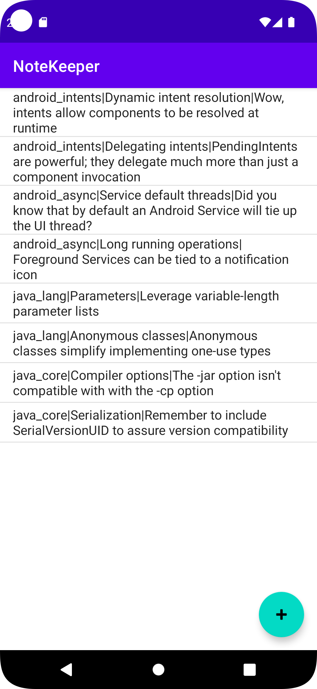

# Note Keeper



### Content
- Note List Activity
- Note Edit Activity

---

#### NoteListActivity.java
```
public class NoteListActivity extends AppCompatActivity {

    private ActivityNoteListBinding binding;
    private ArrayAdapter mNoteListAdapter;

    @Override
    protected void onCreate(Bundle savedInstanceState) {
        super.onCreate(savedInstanceState);
        binding = ActivityNoteListBinding.inflate(getLayoutInflater());
        setContentView(binding.getRoot());
        setSupportActionBar(binding.toolbar);
        Intent newNoteIntent = new Intent(this, NoteActivity.class);
        binding.fab.setOnClickListener(v -> {
            startActivity(newNoteIntent);
        });
        initializeDisplayContent();
    }

    @Override
    protected void onResume() {
        super.onResume();
        mNoteListAdapter.notifyDataSetChanged();
    }

    private void initializeDisplayContent() {
        final ListView noteList = findViewById(R.id.lv);
        List<NoteInfo> notes = DataManager.getInstance().getNotes();
        mNoteListAdapter = new ArrayAdapter(this,
                android.R.layout.simple_list_item_1, notes);
        noteList.setAdapter(mNoteListAdapter);
        noteList.setOnItemClickListener((parent, view, position, id) -> {
//            NoteInfo note = (NoteInfo) noteList.getItemAtPosition(position);
            Intent noteIntent = new Intent(NoteListActivity.this, NoteActivity.class);
            noteIntent.putExtra(NoteActivity.NOTE_POS, position);
            startActivity(noteIntent);
        });
    }
}
```
---
### Note Activity
- NoteActivity.java
- NoteActivityViewModel.java

#### NoteActivity.java
```
public class NoteActivity extends AppCompatActivity {
    public static final String NOTE_POS = "com.example.notekeeper.NOTE_POSITION";
    public static final int POS_NOT_SET = -1;
    private ActivityNoteBinding binding;
    private NoteInfo mNote;
    private boolean mIsNewNote;
    private Spinner mSpinnerCourses;
    private EditText mTextNoteTitle;
    private EditText mTextNoteDetails;
    private int mNotePosition;
    private boolean mIsCancelling;
    private NoteActivityViewModel mViewModel;

    @Override
    protected void onCreate(Bundle savedInstanceState) {
        super.onCreate(savedInstanceState);
        binding = ActivityNoteBinding.inflate(getLayoutInflater());
        setContentView(binding.getRoot());

        ViewModelProvider viewModelProvider = new ViewModelProvider(
                getViewModelStore(), getDefaultViewModelProviderFactory());
        mViewModel = viewModelProvider.get(NoteActivityViewModel.class);

        if (mViewModel.mIsNewlyCreated && savedInstanceState != null)
            mViewModel.restoreState(savedInstanceState);

        mViewModel.mIsNewlyCreated = false;

        setSupportActionBar(binding.toolbar);

        mSpinnerCourses = binding.incNote.spinnerCourses;
        mTextNoteTitle = binding.incNote.textNoteTitle;
        mTextNoteDetails = binding.incNote.textNoteText;

        List<CourseInfo> courses = DataManager.getInstance().getCourses();

        ArrayAdapter<CourseInfo> adapterCourses = new ArrayAdapter<>
                (this, android.R.layout.simple_spinner_item, courses);
        adapterCourses.setDropDownViewResource(android.R.layout.simple_spinner_dropdown_item);

        mSpinnerCourses.setAdapter(adapterCourses);

        readDisplayStateValues();
        saveOriginalNoteValues();
        if (!mIsNewNote)
            displayNote(mSpinnerCourses, mTextNoteTitle, mTextNoteDetails);
    }

    @Override
    protected void onSaveInstanceState(@NonNull Bundle outState) {
        super.onSaveInstanceState(outState);
        if (outState != null)
            mViewModel.saveState(outState);
    }

    private void saveOriginalNoteValues() {
        if (mIsNewNote)
            return;
        mViewModel.mOriginalCourseId = mNote.getCourse().getCourseId();
        mViewModel.mOriginalNoteTitle = mNote.getTitle();
        mViewModel.mOriginalNoteText = mNote.getText();
    }

    private void displayNote(Spinner spinnerCourses, EditText textNoteTitle,
                             EditText textNoteDetails) {
        textNoteTitle.setText(mNote.getTitle());
        textNoteDetails.setText(mNote.getText());
        int courseIndex = DataManager.getInstance().getCourses().indexOf(mNote.getCourse());
        spinnerCourses.setSelection(courseIndex);
    }

    @Override
    public boolean onCreateOptionsMenu(Menu menu) {
        // Inflate the menu; this adds items to the action bar if it is present.
        getMenuInflater().inflate(R.menu.menu_note, menu);
        return true;
    }

    @Override
    public boolean onOptionsItemSelected(MenuItem item) {
        // Handle action bar item clicks here. The action bar will
        // automatically handle clicks on the Home/Up button, so long
        // as you specify a parent activity in AndroidManifest.xml.
        int id = item.getItemId();

        //noinspection SimplifiableIfStatement
        if (id == R.id.action_send_mail) {
            sendEmail();
            return true;
        } else if (id == R.id.action_cancel) {
            mIsCancelling = true;
            finish();
        }
        return super.onOptionsItemSelected(item);
    }

    @Override
    protected void onPause() {
        super.onPause();
        if (mIsCancelling) {
            if (mIsNewNote)
                DataManager.getInstance().removeNote(mNotePosition);
            else
                storePreviousNoteValues();
        } else saveNote();
    }

    private void storePreviousNoteValues() {
        mNote.setCourse(DataManager.getInstance().getCourse(mViewModel.mOriginalCourseId));
        mNote.setTitle(mViewModel.mOriginalNoteTitle);
        mNote.setText(mViewModel.mOriginalNoteText);
    }

    private void saveNote() {
        mNote.setCourse((CourseInfo) mSpinnerCourses.getSelectedItem());
        mNote.setTitle(mTextNoteTitle.getText().toString());
        mNote.setText(mTextNoteDetails.getText().toString());
    }

    private void sendEmail() {
        CourseInfo course = (CourseInfo) mSpinnerCourses.getSelectedItem();
        String subject = mTextNoteTitle.getText().toString();
        String text = "Checkout what I learned in the Pluralsight course \"" +
                course.getTitle() + "\"\n" + mTextNoteDetails.getText();
        Intent intent = new Intent(Intent.ACTION_SEND);
        intent.setType("message/rfc2822");
        intent.putExtra(Intent.EXTRA_SUBJECT, subject);
        intent.putExtra(Intent.EXTRA_TEXT, text);
        startActivity(intent);
    }

    public void readDisplayStateValues() {
        Intent intent = getIntent();
        int position = intent.getIntExtra(NOTE_POS, POS_NOT_SET);
        mIsNewNote = position == POS_NOT_SET;
        if (mIsNewNote)
            createNote();
        else
            mNote = DataManager.getInstance().getNotes().get(position);
    }

    private void createNote() {
        DataManager dm = DataManager.getInstance();
        mNotePosition = dm.createNewNote();
        mNote = dm.getNotes().get(mNotePosition);
    }
}
```
#### NoteActivityViewModel.java
```
public class NoteActivityViewModel extends ViewModel {
    public static final String ORIGINAL_NOTE_COURSE_ID = "com.example.notekeeper.ORIGINAL_NOTE_COURSE_ID";
    public static final String ORIGINAL_NOTE_TITLE = "com.example.notekeeper.ORIGINAL_NOTE_TITLE";
    public static final String ORIGINAL_NOTE_TEXT = "com.example.notekeeper.ORIGINAL_NOTE_TEXT";

    public String mOriginalCourseId;
    public String mOriginalNoteText;
    public String mOriginalNoteTitle;

    public boolean mIsNewlyCreated = true;

    public void saveState(Bundle outState) {
        outState.putString(ORIGINAL_NOTE_COURSE_ID, mOriginalCourseId);
        outState.putString(ORIGINAL_NOTE_TITLE, mOriginalNoteTitle);
        outState.putString(ORIGINAL_NOTE_TEXT, mOriginalNoteText);
    }

    public void restoreState(Bundle inState){
        mOriginalCourseId = inState.getString(ORIGINAL_NOTE_COURSE_ID);
        mOriginalNoteTitle = inState.getString(ORIGINAL_NOTE_TITLE);
        mOriginalNoteText = inState.getString(ORIGINAL_NOTE_TEXT);
    }
}
```
